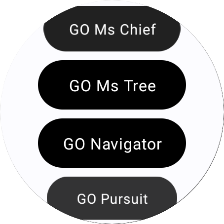

# Sample Wear OS Compose With List

[](https://linktr.ee/nicos_nicolaou)
[](https://nicosnicolaou16.github.io/)
[](https://twitter.com/nicolaou_nicos)
[](https://linkedin.com/in/nicos-nicolaou-a16720aa)
[](https://medium.com/@nicosnicolaou)
[](https://androiddev.social/@nicolaou_nicos)
[](https://bsky.app/profile/nicolaounicos.bsky.social)
[](https://dev.to/nicosnicolaou16)
[](https://www.youtube.com/@nicosnicolaou16)
[](https://g.dev/nicolaou_nicos)

A modern test implementation for **Wear OS** using **Jetpack Compose**. This project demonstrates how to build a circular/square wearable UI with dynamic lists, dependency injection, and local data persistence.

<p align="center">
  
  
</p>

> [!IMPORTANT]  
> Check out the full setup guide here:  
> 👉 **[Standalone Wear OS Application (Setup for Jetpack Compose and Flutter) - Medium](https://medium.com/@nicosnicolaou/standalone-wear-os-application-jetpack-compose-and-flutter-5a37f4775ed8)** 👈

> [!IMPORTANT]
> Similar project (Dart/Flutter version):  
> 👉 **[SampleWearOSWithList (Flutter)](https://github.com/NicosNicolaou16/SampleWearOSWithList)** 👈

## ✨ Key Features & Technologies

*   **[Wear OS Support](https://developer.android.com/training/wearables):** Optimized for smartwatches, focusing on small screen constraints and battery efficiency.
*   **[Jetpack Compose for Wear](https://developer.android.com/training/wearables/compose):** Modern toolkit for building declarative wearable UIs.
*   **[Navigation 3](https://developer.android.com/guide/navigation/navigation-3):** Modern, Compose-native navigation system using serializable destination keys.
*   **[Shared Element Transition](https://developer.android.com/develop/ui/compose/animation/shared-elements):** Beautiful UI animations when moving from list to details.
*   **[Hilt DI](https://developer.android.com/training/dependency-injection/hilt-android):** Simplifies dependency management and ensures a testable architecture.
*   **[Retrofit & Room](https://developer.android.com/training/data-storage/room):** Remote API data fetching with SpaceX API and local caching for offline support.
*   **[MVVM Architecture](https://developer.android.com/topic/architecture):** Clean separation of concerns with Repositories and ViewModels.
*   **[Glide for Compose](https://bumptech.github.io/glide/int/compose.html):** Efficient image loading and caching.

## 🛠️ Setup

### Manifest Configuration

For Wear OS apps, you must declare the hardware type and specify if the app is standalone.


The project is a test implementation of Jetpack Compose for a Wear OS app that includes API
requests (dynamic list), Hilt for dependency injection, and Room Database. <br />

<a title="simulator_image"></a>
<a title="simulator_image"></a>

# The Project Contain the following technologies

[Wear OS](https://developer.android.com/training/wearables) support refers to adapting an app for
use on smartwatches, ensuring it works well with small
screens, conserves battery life, and utilizes features such as notifications and fitness tracking
specific to wearable devices. <br />
The UI is build using [Jetpack Compose](https://developer.android.com/develop/ui/compose). <br />
The programming language is the [Kotlin](https://kotlinlang.org/docs/getting-started.html), it is a
modern, JVM-based programming language that is concise, safe, and interoperable with Java. <br />
[Kotlin Coroutines](https://kotlinlang.org/docs/coroutines-overview.html) is used for asynchronous
tasks. <br />
[Kotlin KTX](https://developer.android.com/kotlin/ktx) is a collection of Kotlin extensions that
offer more concise and expressive code for working with Android APIs and libraries.
The UI is build using [Jetpack Compose](https://developer.android.com/develop/ui/compose). <br />
For Navigation between screens is use
the [New Navigation Type Safety](https://medium.com/androiddevelopers/navigation-compose-meet-type-safety-e081fb3cf2f8). <br />
For Animation and Navigation from the main screen to details screen is use the
new [Shared Element Transition](https://developer.android.com/develop/ui/compose/animation/shared-elements). ([Shared Element Transition - Article](https://fvilarino.medium.com/shared-element-transitions-in-jetpack-compose-8f553078101e), [Shared Element Transition - Article](https://getstream.io/blog/shared-element-compose/))  <br />
[Retrofit](https://square.github.io/retrofit/) is responsible for making requests and retrieving
data from the remote server. ([Repository](https://github.com/square/retrofit)) <br />
[Room Database](https://developer.android.com/training/data-storage/room) is responsible for saving
the retrieved data from the remote server, querying data from the local database, and supporting
offline functionality.  <br />
[KSP](https://developer.android.com/build/migrate-to-ksp) ("Kotlin Symbol Processing") is a tool for
efficient annotation processing in Kotlin, providing faster code generation and symbol manipulation
compared to KAPT. [Repository](https://github.com/google/ksp) <br />
[Glide](https://bumptech.github.io/glide/) is an Android library for efficiently loading and
displaying images. It handles image caching,
transformations, and supports animations during image
loading. [Documentation Compose](https://bumptech.github.io/glide/int/compose.html), [Repository](https://github.com/bumptech/glide)
[Hilt Dependencies Injection](https://developer.android.com/training/dependency-injection/hilt-android)
is an Android library that simplifies dependency injection by using annotations to automatically
manage and provide dependencies across components, built on top of
Dagger. ([Documentation](https://dagger.dev/hilt/)) <br />
[MVVM](https://developer.android.com/topic/architecture#recommended-app-arch) with repository is an
architecture where the Repository manages data sources (e.g., network, database), the ViewModel
processes the data for the UI, and the View displays the UI, ensuring a clear separation of
concerns. <br />
[Navigation 3](https://developer.android.com/guide/navigation/navigation-3) for Jetpack Compose is a
modern, Compose-native navigation system where you manage a
stack of serializable destination keys and display them with NavDisplay, giving you direct control,
state retention, and flexible adaptive UI without traditional graphs or routes. <br />
[R8](https://developer.android.com/build/shrink-code) enabled, is a code shrinker and obfuscator for
Android that optimizes and reduces the size of APKs by removing unused code and resources, while
also obfuscating the remaining code to improve security. <br />

# Setup

## Setup in Manifest

```xml

<manifest>

    <uses-feature android:name="android.hardware.type.watch" />

    <application>
        <!--other code here-->

        <!--Optional-->
        <meta-data android:name="com.google.android.wearable.standalone" android:value="true" />

        <!--other code here-->
    </application>
</manifest>
```

> [!IMPORTANT]  
> Check my article for the setup :point_right: [Standalone Wear OS Application (Setup for Jetpack Compose and Flutter) - Medium](https://medium.com/@nicosnicolaou/standalone-wear-os-application-jetpack-compose-and-flutter-5a37f4775ed8) :point_left: <br />

> [!IMPORTANT]
> Similar project with (Dart Language) :point_right: [SampleWearOSWithList](https://github.com/NicosNicolaou16/SampleWearOSWithList) :point_left: <br />

# Versioning

Target SDK version: 36 <br />
Minimum SDK version: 29 <br />
Kotlin version: 2.3.20 <br />
Gradle version: 9.1.0 <br />

# Feeds/Urls/End Point (parsing some data from response)

## (Links References for Ends Points)

- https://github.com/r-spacex/SpaceX-API (GitHub) <br />
- https://docs.spacexdata.com/?version=latest (Postman) <br />

# References

- https://medium.com/flutter-community/flutter-building-wearos-app-fedf0f06d1b4 <br />
- https://developer.android.com/training/wearables/compose <br />