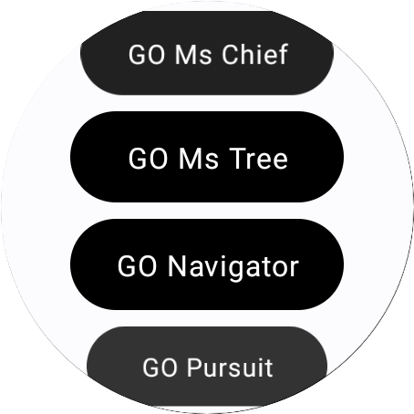

# Sample Wear OS Compose With List

The project is a test implementation of Jetpack Compose for a Wear OS app that includes API
requests (dynamic list), Hilt for dependency injection, and Room Database. <br />

<a title="simulator_image"></a>
<a title="simulator_image"></a>

# The Project Contain the following technologies

[Wear OS](https://developer.android.com/training/wearables) support refers to adapting an app for
use on smartwatches, ensuring it works well with small
screens, conserves battery life, and utilizes features such as notifications and fitness tracking
specific to wearable devices. <br />
The UI is build using [Jetpack Compose](https://developer.android.com/develop/ui/compose). <br />
Hilt <br />
Room Database <br />
Coroutines <br />
Kotlin ktx <br />
MVVM <br />
Support kapt and ksp (ksp only setup for Room Database) <br />
minifyEnabled, shrinkResources, R8 are enabled <br />
Gradle Kotlin DSL <br />
Repository <br />
KSP <br />
Offline <br />

# Setup

## Setup in Manifest

```xml

<manifest>

    <uses-feature android:name="android.hardware.type.watch" />

    <application>
        <!--other code here-->

        <!--Optional-->
        <meta-data android:name="com.google.android.wearable.standalone" android:value="true" />

        <!--other code here-->
    </application>
</manifest>
```

> [!IMPORTANT]  
> Check my article for the setup :point_right: [Standalone Wear OS Application (Setup for Jetpack Compose and Flutter) - Medium](https://medium.com/@nicosnicolaou/standalone-wear-os-application-jetpack-compose-and-flutter-5a37f4775ed8) :point_left: <br />

> [!IMPORTANT]
> Similar project with (Dart Language) :point_right: [SampleWearOSWithList](https://github.com/NicosNicolaou16/SampleWearOSWithList) :point_left: <br />

# Versioning

Target SDK version: 35 <br />
Minimum SDK version: 28 <br />
Kotlin version: 2.0.21 <br />
Gradle version: 8.7.2 <br />

# Feeds/Urls/End Point (parsing some data from response)

## (Links References for Ends Points)

https://github.com/r-spacex/SpaceX-API (GitHub) <br />
https://docs.spacexdata.com/?version=latest (Postman) <br />

# References

https://medium.com/flutter-community/flutter-building-wearos-app-fedf0f06d1b4 <br />
https://developer.android.com/training/wearables/compose <br />